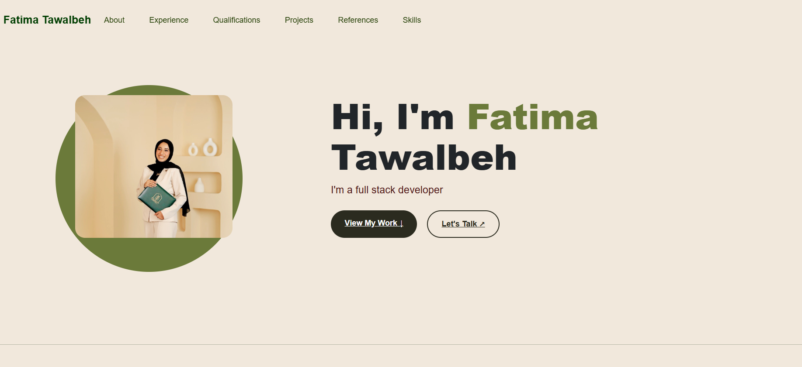

# portfolio
Fatima_Tawalbeh

welcom to my personal protfolio 👋🏼
This is a responsive personal protgolio website designed to introduce me, showcase my skills and projects, and provide a way to get in touch with me.
_______________________________________________________________________
About Me⚡
I am a Computer Information Systems (CIS) graduate with an interest in Full Stack Development, Artificial Intelligence, and Data Analysis.

I enjoy building modern, responsive websites and exploring technology to create useful digital solutions.
________________________________________________________________________
Features🚀
*Responsive design for desktop, tablet, and mobile.
*Modern and clean UI.
*Smooth navigation between sections.
*About Me section.
*Skills & Technologies.
*Projects showcase.
*Education / Career Journey.
*Contact section.
_______________________________________________________________________
Technologies Used 🛠️ :
HTML5
CSS3
Responsive Web Design
Git & GitHub
_________________________________________________________________
 Sections📂:
 about__ Introdaction and personal overview 
 experinces__MY education and parctical journey
 projrcts__ selected projects 
 skills__soft &technqail skills
 qualification __ the degree i gained and a training
 referance __ avilable upon requsets
________________________________________________________________________
 design🖌️🖋️🎨:
 The portfolio uses a Cream, Olive, Dark Green, and Gold color palette to create a modern, elegant, and professional look.
________________________________________________________________________
 Preview📸 :

________________________________________________________________________
 ContacC🌐:
 email:fatimatawalbeh9@gmail.com
 linkedin : Fatima Tawalbeh
 GitHub:fatimaT2023
numper for whattsap :+962772574463

_______________________________________________________________________
If you like this project, feel free to give it a star!

Designed & built by Fatima Tawalbeh · 2026